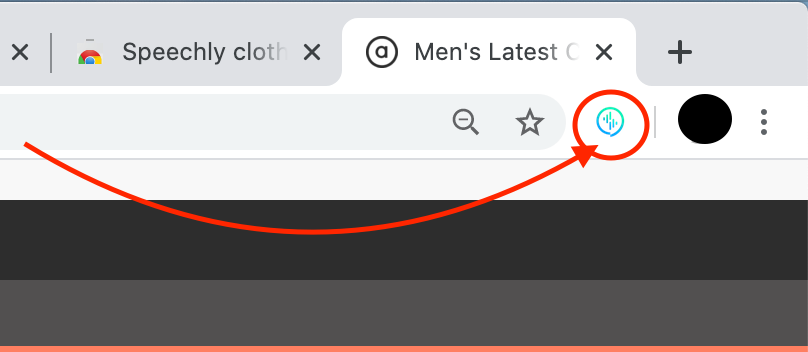

<div align="center" markdown="1">
<a href="https://www.speechly.com/?utm_source=github&utm_medium=browser-client&utm_campaign=header">
   
</a>

### Speechly is the Fast, Accurate, and Simple Voice Interface API for Web, Mobile and E‑commerce

[Website](https://www.speechly.com/?utm_source=github&utm_medium=browser-client&utm_campaign=header)
&ensp;|&ensp;
[Docs](https://docs.speechly.com/)
&ensp;|&ensp;
[Discussions](https://github.com/speechly/speechly/discussions)
&ensp;|&ensp;
[Blog](https://www.speechly.com/blog/?utm_source=github&utm_medium=browser-client&utm_campaign=header)
&ensp;|&ensp;
[Podcast](https://anchor.fm/collin-borns/episodes/The-Speechly-Podcast---Introduction-e15htlq)

---
</div>

# Speechly shopping demo

This is a simple Chrome extension that shows how [Speechly](https://www.speechly.com/?utm_source=github&utm_medium=clothing-store-demo&utm_campaign=text) enables easily filtering products by voice. 
Speechly configuration for the app can be found in [speechly_config.sal](speechly_config.sal).

Built with:

- [speechly-browser-client](https://github.com/speechly/browser-client)
- [chrome-extension-typescript-starter](https://github.com/chibat/chrome-extension-typescript-starter)
- [TypeScript](https://www.typescriptlang.org)

You can easily set it up locally to your Chrome browser.

## About Speechly

Speechly is a developer tool for building real-time multimodal voice user interfaces. It enables developers and designers to enhance their current touch user interface with voice functionalities for better user experience. Speechly key features:

#### Speechly key features

- Fully streaming API
- Multi modal from the ground up
- Easy to configure for any use case
- Fast to integrate to any touch screen application
- Supports natural corrections such as "Show me red – i mean blue t-shirts"
- Real time visual feedback encourages users to go on with their voice

| Example application | Description |
| :---: | --- |
|  | Instead of using buttons, input fields and dropdowns, Speechly enables users to interact with the application by using voice. <br />User gets real-time visual feedback on the form as they speak and are encouraged to go on. If there's an error, the user can either correct it by using traditional touch user interface or by voice. |

### NOTE for React users

You can refer to our [React client example](https://github.com/speechly/react-example-repo-filtering/) to build something like this on React.

## How to use it?

Install the extension either from [Chrome Web Store](https://chrome.google.com/webstore/detail/cdlhelepiigikijnjmkonhhpdcmojlaa) or by following [these steps](https://github.com/speechly/clothing-store-demo#install-the-local-version-to-your-browser).

After installation you can find the Speechly icon next to URL bar:



Go to [ASOS](https://www.asos.com) and navigate 'Men' or 'Women' -> 'New in' -> 'View all'. Click the Speechly icon to open a small popup with the microphone.
Speak aload your command while pressing the mic. You can see the transcript of your speech below the mic.

If you use the code as it is and the default SAL configuration [speechly_config.sal](speechly_config.sal), you can test it by saying for example
- filter the products from puma
- filter the medium sizes
- filter the orange colour

## Development
### Prerequisites

* [node + npm](https://nodejs.org/) (Current Version)

Install dependencies.
```
npm install
```
Build the extension to `dist` directory

```
npm run build
```
Build in watch mode
```
npm run watch
```
Test `npm run test`

### Install the local version to your browser

1. Clone the repository locally
2. Run `mv .env.local .env` and add your Speechly app id to .env file
3. Run `npm run build` to build the Chrome extension. Now `dist/` should contain the extension.
4. Navigate to `chrome://extensions` in your chrome browser. Expand the Developer dropdown menu and click "Load Unpacked Extension"
5xw. Choose the `dist` directory and click Ok
